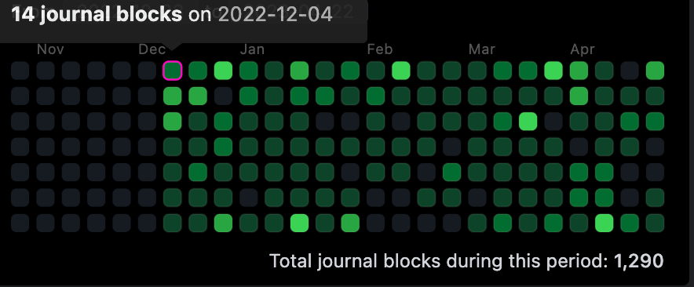
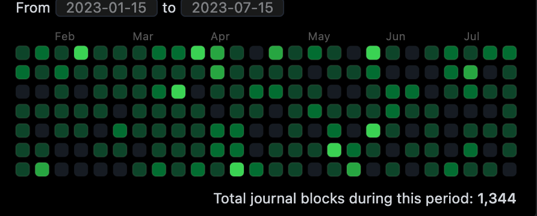
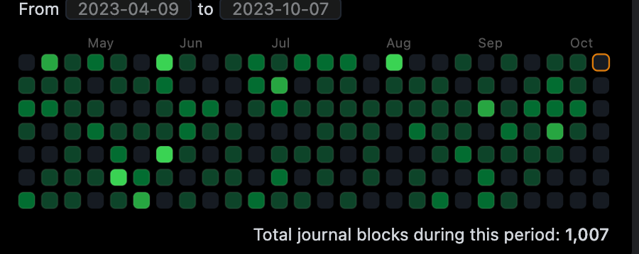

# 初见

## 为什么创建博客

主要是因为我没有博客, 所以我想搭一个, 哈哈哈.
我的第一篇想要输出的博客内容应该是在大四的时候，那时候应该 `COVID-19`，都困在家里完成毕业设计和毕业论文。那会的毕业设计算是接了一个坑，是一个 ROS+SLAM 的机器人，老师给了我一个没有任何中文资料的激光雷达，我又去买了一个刚出树莓派 4B 来做系统。当时的中文资料比较有限，只能靠着自己摸索，和翻墙找资料，最后一点一点填出来。我当时想着既然没有啥中文资料，那不如自己写一个，就在 CSDN 上发了一篇关于在树莓派 4B 搭建 ROS 的博客。

后来毕业之后，就转岗到 Java 开发了，完全从零基础就要上工的过程真的很痛苦，因为我也不是科班的，当时就花钱买了一个网上的培训课程，一心想着学成之后离开那家公司。

当时上课做的笔记，自己总结一下就放到了 CSDN 上，主要是一种炫耀的心情吧，我自己认为最重要的原因就是想放在简历上，可以让面试官觉得自己稍微有点技术追求之类的。
现在的 CSDN 已经在国内的技术圈子里开始臭名昭著了，所以我也不太愿意在上面发东西了。所以后面工作和业余的记录就通过 Typroa 写完上传到 Github 上。

后来就一直用 markdown 记录，不过创建目录、文件应该放在什么位置，对我来说需要耗费心力的事情，我又是一个又懒又拖延的人，这样会让我不愿意去记录东西。后来在网上就刷到了双链笔记的相关文章，非常火的是 notion ，主要我觉得因为它对网络有一定要求，所以不是很喜欢。我还是更希望自己用一个纯本地的文本编辑: `bsidian` 和 `logseq`，其实都能满足我的需求了，最后是因为 UI ，选了我自己认为比较轻便的 logseq。

就这样，我就在 2022 年底，我过上了几乎每天都在记录的日子，记录自己的想法，自己的读书笔记，记录看技术文章或技术视频，记录看到的推文...

<!--  -->

随着记录不断增多，让我觉得我可能又只是在做一个小松鼠而已，自己的思考和总结并没有很大的提升。我一昧的记录，对我吸收知识帮助不是特别大。
最近因为尝试把学习练手 Vue3 的静态网站搭建在 Gitub Pages 上，发现并不难。所以想自己尝试把自己的博客搭建起来，通过写博文的方式，让自己有动力去把日常记录的内容总结一下。

## 技术选型

### 开源博客

1. [Hexo](https://hexo.io/)
2. [Hugo](https://gohugo.io/)
3. [VuePress](https://vuepress.vuejs.org/)
4. [VitePress](https://vitepress.dev/)

主要是想体验一下不同的技术，所以选择了基于 `go` 的 `hugo`

### 服务器

直接白嫖 [GitHub Pages](https://pages.github.com/)

### 编辑器

`Visual Studio Code`

它真的非常适合，既能装 markdown 插件，又能作为 Git 的可视化，还能有 terminal 来方便我们敲命令。

## 需要会什么

折腾技术的最不怕不会任何东西， 应该都会有一颗保持好奇的心， 学习应该算是一件比较简单的事情啦， 又加上搜索引擎， 甚至用上如同 ChatGPT 这种的 AI 工具， 还是能解决我们大部分学习需求的吧。

1. Git: 毕竟要用到 Github, 而且有一定的版本管理还能方便咱们回溯内容
2. Shell 命令: 安装

