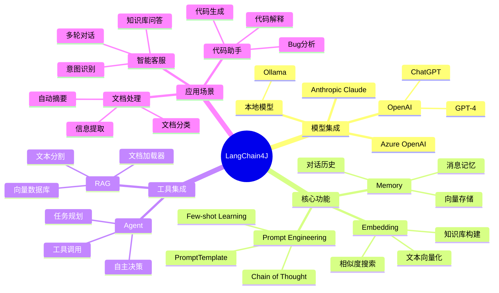

# LangChain4J 功能架构详解

<!--more-->

## LangChain4J 功能架构

## 功能模块详解

### 1. 模型集成

LangChain4J 支持多种大语言模型的接入，包括：

- OpenAI 的 GPT 系列
- Azure OpenAI 服务
- Anthropic Claude
- 本地部署的开源模型

### 2. 核心功能

核心功能模块提供了构建 AI 应用的基础能力：

- Prompt 工程：模板管理和优化
- 记忆系统：对话历史管理
- 向量计算：文本嵌入和相似度计算

### 3. 工具集成

提供了丰富的工具集成能力：

- RAG：支持文档检索和知识库构建
- Agent：支持复杂任务的规划和执行

### 4. 应用场景

常见的应用场景包括：

- 智能客服系统
- 文档处理自动化
- AI 辅助编程

## 总结

LangChain4J 提供了完整的 AI 应用开发框架，通过合理使用这些功能模块，可以快速构建强大的 AI 应用。

