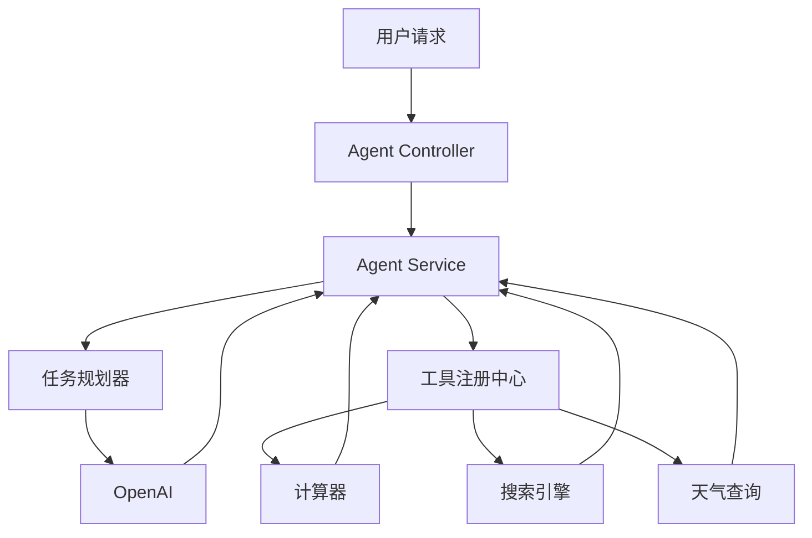

# SpringBoot + LangChain4j 实现智能 AI Agent


<!--more-->

## 什么是 AI Agent？

AI Agent 是一个能够自主决策和执行任务的智能代理。它可以：

- 理解用户意图
- 规划任务步骤
- 调用工具完成任务
- 处理异常情况
- 持续优化决策

## 系统架构



## 项目实现

### 1. Maven 依赖配置

```xml
<dependencies>
  <!-- SpringBoot -->
  <dependency>
    <groupId>org.springframework.boot</groupId>
    <artifactId>spring-boot-starter-web</artifactId>
  </dependency>

  <!-- LangChain4j -->
  <dependency>
    <groupId>dev.langchain4j</groupId>
    <artifactId>langchain4j</artifactId>
    <version>0.27.1</version>
  </dependency>

  <!-- LangChain4j Agent -->
  <dependency>
    <groupId>dev.langchain4j</groupId>
    <artifactId>langchain4j-agent</artifactId>
    <version>0.27.1</version>
  </dependency>
</dependencies>
```

### 2. 工具实现

```java
@Tool
public class Calculator {

    @ToolFunction
    public double add(double a, double b) {
        return a + b;
    }

    @ToolFunction
    public double multiply(double a, double b) {
        return a * b;
    }
}

@Tool
public class WeatherService {

    @ToolFunction
    public String getWeather(String city) {
        // 调用天气 API
        return "晴天，温度 25℃";
    }
}
```

### 3. Agent 服务实现

```java
@Service
@Slf4j
public class AIAgentService {

    private final ChatLanguageModel chatModel;
    private final ToolRegistry toolRegistry;
    private final Agent agent;

    public AIAgentService(ChatLanguageModel chatModel) {
        this.chatModel = chatModel;
        this.toolRegistry = new ToolRegistry();

        // 注册工具
        toolRegistry.registerTool(new Calculator());
        toolRegistry.registerTool(new WeatherService());

        // 创建 Agent
        this.agent = Agent.builder()
            .chatLanguageModel(chatModel)
            .toolRegistry(toolRegistry)
            .build();
    }

    public String process(String userInput) {
        try {
            AgentResponse response = agent.process(userInput);
            return response.getOutput();
        } catch (Exception e) {
            log.error("Agent 处理失败", e);
            return "抱歉，我现在无法处理这个请求";
        }
    }
}
```

### 4. Controller 实现

```java
@RestController
@RequestMapping("/api/agent")
public class AgentController {

    private final AIAgentService agentService;

    public AgentController(AIAgentService agentService) {
        this.agentService = agentService;
    }

    @PostMapping("/chat")
    public ResponseEntity<String> chat(@RequestBody String message) {
        String response = agentService.process(message);
        return ResponseEntity.ok(response);
    }
}
```

## Agent 工作流程


sequenceDiagram
participant User as 用户
participant Agent as AI Agent
participant LLM as 大语言模型
participant Tools as 工具集

    User->>Agent: 发送请求
    Agent->>LLM: 分析用户意图
    LLM-->>Agent: 返回任务分解
    loop 任务执行
        Agent->>Tools: 调用相关工具
        Tools-->>Agent: 返回工具结果
        Agent->>LLM: 结果评估
        LLM-->>Agent: 下一步计划
    end
    Agent->>User: 返回最终结果



## 示例场景

### 1. 数学计算场景

用户输入：

```text
请帮我计算：(23 + 45) * 2 是多少？
```

Agent 处理流程：

1. 分析出需要使用计算器工具
2. 拆分为加法和乘法两步
3. 调用计算器完成计算
4. 返回结果

### 2. 天气查询场景

用户输入：

```text
北京今天天气怎么样？需要带伞吗？
```

Agent 处理流程：

1. 识别需要查询天气
2. 调用天气服务获取数据
3. 分析是否需要带伞
4. 给出建议

## 最佳实践

### 1. 错误处理

```java
public class AgentException extends RuntimeException {
    public AgentException(String message) {
        super(message);
    }
}

@ControllerAdvice
public class AgentExceptionHandler {

    @ExceptionHandler(AgentException.class)
    public ResponseEntity<String> handleAgentException(AgentException e) {
        return ResponseEntity
            .status(HttpStatus.INTERNAL_SERVER_ERROR)
            .body(e.getMessage());
    }
}
```

### 2. 性能优化



1. 使用工具结果缓存
2. 实现并发任务处理
3. 设置合理的超时时间
   

### 3. 监控指标

```java
@Service
public class AgentMetricsService {

    private final MeterRegistry registry;

    public void recordToolUsage(String toolName) {
        registry.counter("agent.tool.usage", "tool", toolName).increment();
    }

    public void recordProcessingTime(long milliseconds) {
        registry.timer("agent.processing.time").record(milliseconds, TimeUnit.MILLISECONDS);
    }
}
```

## 安全考虑



1. 工具调用权限控制
2. 用户输入验证
3. 敏感信息保护
4. 调用频率限制
   

## 总结

通过 SpringBoot + LangChain4j 实现的 AI Agent 具有以下优势：

1. 架构清晰，易于扩展
2. 工具集成灵活
3. 错误处理完善
4. 性能监控到位

在实际应用中，可以根据具体需求：

- 添加更多工具
- 优化决策逻辑
- 增强安全机制
- 提升用户体验

## 参考资料

- [LangChain4j Agent 文档](https://docs.langchain4j.dev/agent)
- [SpringBoot 官方文档](https://spring.io/projects/spring-boot)
- [OpenAI API 文档](https://platform.openai.com/docs/api-reference)

